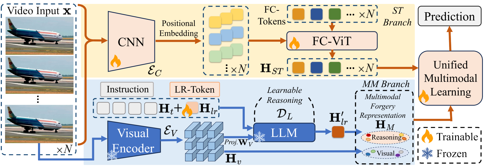

# MM-Det Plus

This repository is the official implementation of MM-Det Plus (Paper: Consolidating Diffusion-Generated Video Detection with Multi-modal Forgery Representations).

<table class="center">
    <tr>
    <td></td>
    </tr>
</table>


## Contents

  - [Environment](#environment)
  - [Diffusion Video Forensics Dataset (Extended)](#diffusion-video-forensics-dataset-extended)
  - [Preparation](#preparation)
    - [Pre-trained Weights](#pre-trained-weights)
    - [Reconstruction Dataset](#reconstruction-dataset)
    - [Diffusion Video Forensics Dataset (Extended)](#diffusion-video-forensics-dataset-extended)
  - [Training](#training)
    - [MLLM Fine-tuning (Not necessary)](#mllm-fine-tuning-not-necessary)
    - [End-to-end Training](#end-to-end-training)
  - [Evaluation](#evaluation)
    - [Official Dataset Evaluation](#official-dataset-evaluation)
    - [Customized Dataset Evaluation](#customized-dataset-evaluation)
  - [Acknowledgement]
  
## Environment

1. Install basic packages
```bash
conda create -n MM_Det_Plus python=3.10
conda activate 
pip install -r requirements.txt
cd third_party/LLaVA
pip install -e .
```
2. For training cases, install additional packages
```bash
cd third_party/LLaVA
pip install --upgrade pip
pip install -e ".[train]"
pip install flash-attn==2.5.8 --no-build-isolation
```

## Diffusion Video Forensics Dataset (Extended)

We release the extended version of Diffusion Video Forensics (DVF) as the benchmark for forgery video detection. Differences between [previous version](https://github.com/SparkleXFantasy/MM-Det) and this one are:
- Two additional methods ([HunyuanVideo](https://github.com/Tencent-Hunyuan/HunyuanVideo) and [CogVideoX](https://github.com/zai-org/CogVideo)) are included as the latest AIGC content.
- For each classes, equivalent real and fake videos are paired for semantically fair comparsions.

The full version of DVF can be downloaded via links: [BaiduNetDisk](https://pan.baidu.com/s/1zncWxyy0Ihj2ceIiQ3e_jA?pwd=d6sm)(Code: d6sm). The huggingface version is coming soon.

## Training

### MLLM Fine-tuning (Not necessary)
Our LMM branch is built upon [LLaVA](https://github.com/haotian-liu/LLaVA), with [llava-v1.5-Vicuna-7b](https://huggingface.co/liuhaotian/llava-v1.5-7b) set as the base model. Our fine-tuned LMM weights can be achieved [here](https://huggingface.co/sparklexfantasy/llava-1.5-7b-vctuned)(#pretrained-weights). It is recommended to start the overall training directly using our pretrained MLLM weights, otherwise the fine-tuning result may not be steady.

We directly conduct the visual instruction tuning stage in [LLaVA](https://github.com/haotian-liu/LLaVA#train) on our gemini-generated instruction dataset [rfrd-vc](./data/rfrd-vc), which is a text-image paired dataset of frame description and forensic anaylses for VideoCrafter1. For more information on customized MLLM fine-tuning, please refer to [LLaVA](https://github.com/haotian-liu/LLaVA).

### End-to-end Training

1. Prepare the [extended DVF](#diffusion-video-forensics-dataset-extended) for training.
```
|--data
   |--DVF_PP
      |--videocrafter 
         |-- ...
```
2. Prepare the pretrained checkpoints for the [MLLM](https://huggingface.co/sparklexfantasy/llava-1.5-7b-vctuned/) and the [spatio-temporal](https://drive.google.com/drive/folders/1DSsikRLWjF3hhupPzUzuGWsABOER47qQ?usp=sharing) branch. Put them in `./weights` as:
```
|--weights
   |--llava-1.5-7b-vctuned
   |--vit_base_r50_s16_224.orig_in21k
```

3. Run the following script.
```bash
bash scripts/train.sh
```

## Evaluation

### Official Dataset Evaluation
1. Prepare the [extended DVF](#diffusion-video-forensics-dataset-extended) for evaluation as:
```
|--data
   |--DVF_PP
      |--cogvideox
         |-- ...
      |--[other classes] ...
```

2. Prepare the pretrained checkpoints for the [MLLM](https://huggingface.co/sparklexfantasy/llava-1.5-7b-vctuned/) and the unified detection framework [MM-Det-Plus](placeholder) as:
```
|--weights
   |--llava-1.5-7b-vctuned
   |--MM-Det-Plus
```

3. Run the following scripts:
```bash
bash scripts/test.sh
```

### Customized Dataset Evaluation
1. Prepare your customized videos at `.mp4` format. Put real and fake videos at `0_real` and `1_fake`, respectively. The data strcture is organized as:
```
|--YOUR_DATA_ROOT
   |--customized
      |--0_real
         |-- XX.mp4
      |--1_fake
         |-- XX.mp4
```

2. Prepare the pretrained checkpoints for the [MLLM](https://huggingface.co/sparklexfantasy/llava-1.5-7b-vctuned/) and the unified detection framework [MM-Det-Plus](placeholder) as:
```
|--weights
   |--llava-1.5-7b-vctuned
   |--MM-Det-Plus
```

3. Change the configurations in `scripts/test-custom.sh`:
- Set `--data-root` as `$YOUR_DATA_ROOT`.
- `--classes` is set as `customized` as default. For customized classes, please change the argument as your dataset(e.g., `--classes CLS_A CLS_B CLS_C ...` for testing folders A, B and C).
- Make sure the `--mllm-ckpt` and `--ckpt-path` are correct.

4. Run the script.
```bash
bash scripts/test-custom.sh
```

## Acknowledgement

We express our sincere appreciation to the following projects.

- [LLaVA](https://github.com/haotian-liu/LLaVA)
- [pytorch-image-models](https://github.com/huggingface/pytorch-image-models)
- [pytorch-vqvae](https://github.com/ritheshkumar95/pytorch-vqvae)
- [Stable Diffusion](https://github.com/comfyanonymous/ComfyUI)
- [VideoCrafter1](https://github.com/AILab-CVC/VideoCrafter)
- [Zeroscope](https://huggingface.co/cerspense/zeroscope_v2_576w)
- [OpenSora](https://github.com/hpcaitech/Open-Sora)
- [Stable Video Diffusion](https://github.com/Stability-AI/generative-models).
- [HunyuanVideo](https://github.com/Tencent-Hunyuan/HunyuanVideo)
- [CogVideoX](https://github.com/zai-org/CogVideo)


[def]: #acknowledgement